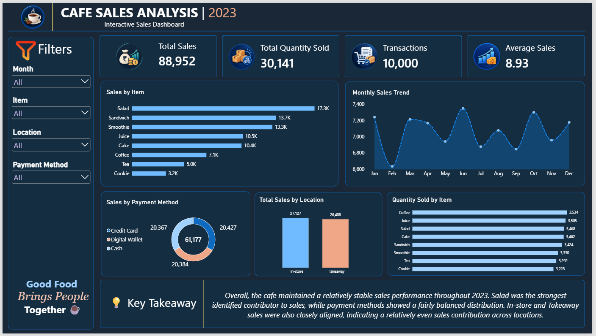

# ☕ Cafe Sales Analysis | Final Data Analytics Project

## 📊 Project Overview

This project presents an end-to-end **Cafe Sales Analysis case study** completed as part of my **Data Analyst Internship at SWYNEX Technologies**.

The project combines the complete analytics workflow:

**Data Cleaning → Exploratory Data Analysis → Power BI Dashboard → Business Insights**

The objective was to transform raw cafe transaction data into a cleaned, analyzed, and interactive business intelligence solution.

---

## 🎯 Problem Statement

The cafe sales dataset contains transaction-level information with data quality issues and multiple business dimensions.

The objective of this project was to:

- Clean and prepare the raw sales data
- Explore sales performance and transaction patterns
- Identify useful trends and patterns
- Build an interactive dashboard for business analysis
- Present key findings clearly

---

## 🗂️ Dataset Information

The project uses a Cafe Sales dataset containing **10,000 transactions** and **8 columns**.

### Dataset Columns

- Transaction ID
- Item
- Quantity
- Price Per Unit
- Total Spent
- Payment Method
- Location
- Transaction Date

### Dataset Files

- [Raw Cafe Sales Dataset](Dirty_cafe_sales.csv)
- [Cleaned Cafe Sales Dataset](Cleaned_Cafe_Sales.csv)

---

## 🧹 Task 1 — Data Cleaning & Preparation

The raw dataset was cleaned and prepared using **Microsoft Excel and Power Query**.

### Cleaning Activities

- Replaced invalid `UNKNOWN` and `ERROR` values with null where appropriate
- Reconstructed values logically where sufficient information was available
- Reviewed missing categorical values
- Verified data types
- Checked for duplicate records
- Standardized the Transaction Date field
- Preserved records where missing information could not be logically inferred

### Logical Data Reconstruction

- `Total Spent = Quantity × Price Per Unit`
- `Quantity = Total Spent ÷ Price Per Unit`
- `Price Per Unit = Total Spent ÷ Quantity`

Records that could not be logically reconstructed were retained with missing values.

### Task 1 File

[Open Data Cleaning Workbook](Task-1-Data-Cleaning/Cafe_sales_Data_Cleaning.xlsx)

---

## 📈 Task 2 — Exploratory Data Analysis

The cleaned dataset was analyzed using **Microsoft Excel**.

### Key Performance Indicators

| KPI | Value |
|---|---:|
| Total Sales | ₹88,952 |
| Total Quantity Sold | 30,141 |
| Transactions | 10,000 |
| Average Sales | ₹8.93 |

### Descriptive Statistics

| Metric | Value |
|---|---:|
| Median Sales | ₹8 |
| Maximum Sales | ₹25 |
| Minimum Sales | ₹1 |
| Standard Deviation | 6.00 |

### Analysis Performed

- Item-wise sales analysis
- Payment method analysis
- Location-wise sales analysis
- Monthly sales trend analysis
- Quantity sold by item
- Descriptive statistical analysis
- Data quality observations

### Key EDA Findings

- **Salad** was the strongest identified contributor to sales at ₹17,320.
- **Cookie** recorded the lowest identified item sales at ₹3,223.
- Among recorded payment methods, **Credit Card** had the highest sales at ₹20,427.
- **In-store** and **Takeaway** sales were relatively close, at ₹27,127 and ₹26,487.50 respectively.
- During January–December 2023, monthly sales remained relatively stable, with **June** recording the highest monthly sales at ₹7,350.
- Missing categorical values were retained where they could not be logically inferred.

### Task 2 File

[Open EDA Workbook](Task-2-EDA/Cafe_Sales_EDA.xlsx)

---

## 📊 Task 3 — Interactive Power BI Dashboard

The cleaned and analyzed data was used to develop an interactive dashboard in **Microsoft Power BI**.

### Dashboard Components

**KPI Cards**

- Total Sales
- Total Quantity Sold
- Number of Transactions
- Average Sales

**Visualizations**

- Sales by Item
- Monthly Sales Trend
- Sales by Payment Method
- Sales by Location
- Quantity Sold by Item

**Interactive Filters**

- Month
- Item
- Location
- Payment Method

### DAX Measures

The dashboard uses DAX measures for the main KPIs.

#### Total Sales

```DAX
Total Sales = SUM('Cafe Sales Data'[Total Spent])
```

#### Total Quantity Sold

```DAX
Total Quantity Sold = SUM('Cafe Sales Data'[Quantity])
```

#### Number of Transactions

```DAX
Number of Transactions = COUNTROWS('Cafe Sales Data')
```

#### Average Sales

```DAX
Average Sales = AVERAGE('Cafe Sales Data'[Total Spent])
```

### Dashboard Preview



### Power BI Files

- [Power BI Dashboard File](Task-3-PowerBI/Cafe_Sales_Dashboard.pbix)
- [Dashboard Screenshot](Task-3-PowerBI/Cafe_Sales_Dashboard.png)

---

## 💡 Key Business Insights

The combined analysis indicates that the cafe maintained a **relatively stable sales performance throughout 2023**.

- Salad was the strongest identified contributor to sales.
- Recorded payment methods showed a fairly balanced distribution.
- In-store and Takeaway sales were closely aligned.
- Monthly sales remained within a relatively consistent range during 2023.
- The dashboard provides an interactive way to explore these patterns by month, item, location, and payment method.

---

## 🔍 Data Quality Consideration

The dataset contains missing values in some categorical fields such as **Item, Payment Method, and Location**.

Where values could not be logically inferred, records were retained instead of being removed or assigned unsupported values.

For dashboard visuals where appropriate, blank categories were excluded from the displayed analysis while preserving the underlying dataset.

---

## 🛠️ Tools & Technologies

- Microsoft Excel
- Power Query
- Microsoft Power BI
- DAX
- GitHub

---

## 🔄 End-to-End Project Workflow

```text
Raw Cafe Sales Data
        ↓
Data Cleaning & Preparation
        ↓
Exploratory Data Analysis
        ↓
KPI & Trend Analysis
        ↓
Power BI Dashboard
        ↓
Business Insights
```

---

## 📁 Project Structure

```text
SWYNEX-Final-Data-Analytics-Project
│
├── Data
│   ├── Dirty_cafe_sales.csv
│   └── Cleaned_Cafe_Sales.csv
│
├── Task-1-Data-Cleaning
│   └── Cafe_sales_Data_Cleaning.xlsx
│
├── Task-2-EDA
│   └── Cafe_Sales_EDA.xlsx
│
└── Task-3-PowerBI
    ├── Cafe_Sales_Dashboard.pbix
    └── Cafe_Sales_Dashboard.png
```

---

## 📚 Learning Outcomes

This final project strengthened my practical understanding of:

- Data cleaning and preparation
- Exploratory data analysis
- KPI development
- Descriptive statistics
- Data visualization
- Power BI dashboard development
- DAX measures
- Interactive slicers
- Business-oriented analysis
- Communicating analytical findings

---

## Internship Context

This project was completed as part of my **Data Analyst Internship at SWYNEX Technologies**.

The project demonstrates the complete workflow developed across the internship tasks:

**Task 1 — Data Cleaning → Task 2 — EDA → Task 3 — Power BI Dashboard → Task 4 — Final Case Study**

---

## 👤 Author

**Prachi Vaishkiyar**

Data Analyst Intern | Aspiring Data Analyst

## 🏷️ Internship Details

**Organization:** SWYNEX Technologies  
**Role:** Data Analyst Intern  
**Project:** Final Cafe Sales Data Analytics Case Study  
**Tools:** Excel, Power Query, Power BI, DAX 
